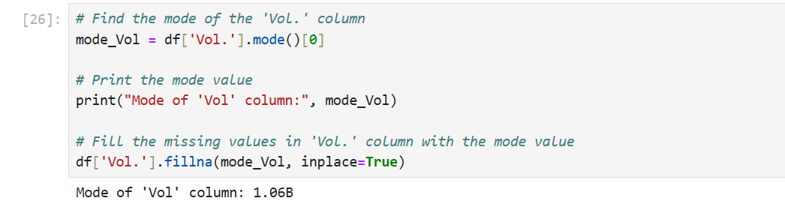
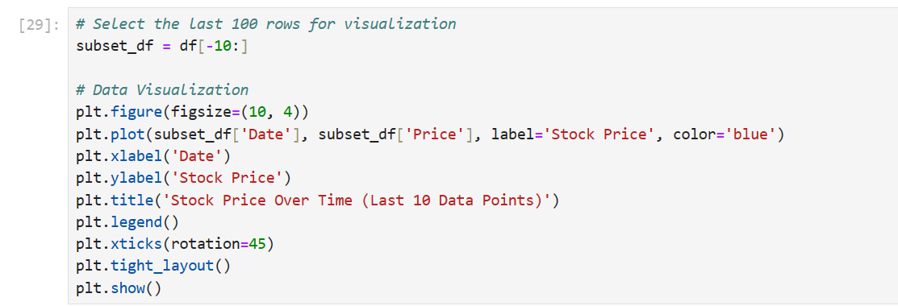

# EDAhistorical-Nigerian-stock-Exchange
Exploratory Analysis on Historical Nigerian Stock Exchange data

# Aim EDAhistorical-Nigerian-stock-Exchange
The aim of undergoing Exploratory data analysis (EDA) on historical Nigerian Stock Exchange data is to gain a better understanding of the trends, pattern, and characteristics of the stock market in Nigeria. 

# Step one: Data Collection

Dataset used here was collected from https://ng.investing.com/indices/nse-all-share-historical-data

Step two: View the dataset:

## Overview of Jupyter Notebook
Go to command prompt and type: pip install jupyter
I believe, you know how to invoke your command propmt from your Windows. Simply type: cmd in the search bar and press enter key. Your command prompt will show up.

Run the jupyter notebook from command prompt by typing: jupyter notebook. 
Dataset was viewed using Python Pandas, dataframe

The libraries need to be installed using the following commands in Jupyter Notebook:
!pip install numpy
!pip install pandas
!pip install scikit-learn
!pip install matplotlib
!pip install seaborn

Functions of the libraries used

1. Pandas: A Python library called Pandas. Data analysis is done using Pandas. Python's Pandas package is used to manipulate data sets. It offers tools for data exploration, cleaning, analysis, and manipulation. Wes McKinney came up with the name "Pandas" in 2008, and it refers to both "Panel Data" and "Python Data Analysis."

2. Numpy: Large, multi-dimensional arrays and matrices can be supported with the Python package Numpy. Additionally, it offers a vast selection of mathematical functions. Listed here are a few of NumPy's fundamental operations:
a. Creating arrays
b. Array indexing
c. Array slicing
d. Data types
e. Copy vs. View
f. Array shape
g. Array reshape

3. Matplotlib: Matplotlib is easy to use and an amazing visualizing library in Python. It is built on NumPy arrays, designed to work with the broader SciPy stack, and consists of several plots like lines, bars, scatters, histograms, etc.

4. Seaborn

Seaborn is a Python data visualization library that helps to visualize the statistical relationships between variables in a dataset. Its plotting functions operate on dataframes and arrays containing whole datasets and internally perform the necessary semantic mapping and statistical aggregation to produce informative plots. Seaborn aims to make visualization the central part of exploring and understanding data. It provides dataset-oriented APIs so that we can switch between different visual representations for the same variables for a better understanding of the data.

5. scikit-learn

Scikit-learn is a Python package that provides a selection of efficient tools for machine learning and statistical modeling. It includes algorithms for classification, regression, clustering, and dimensionality reduction. It is an open-source library that is reusable and easy to interface with other scientific packages. Scikit-learn is used to create and evaluate machine learning models of various types.

# Import the necessary librabries
import numpy as np
import pandas as pd
import matplotlib.pyplot as plt
import seaborn as sn
 
 # Load historical stock market data
 Assume it is, in the following .CSV files as follows
 # Load historical stock market data

# View the dataset

The dataset has 2897 rows and 7 columns

# Description of the stock exchange dataset Columns
1. Date : the date on which the trading data was recorded

2. The closing Price of Stock on particular trading day. This is the last recorede price at the end of the trading session of that day. This is an essential metrics for investors and analyst as it reflects the market's consensus on the stock's value at the end of the trading day.

3. Open: This is the opening price of stock on the same trading day.

4. High: The highest price the stock reached during the same trading day. The High variable is an essential metrics for identifying the highest point the stock reached during the day's trading session, potentially indicating intraday price peaks.

5. Low: The Low column represents the lowest price that the stock reached during the trading day. This metric provides insights into the lowest point the stock hit during the day's trading session, potentially indicating intraday troughs.

6. Vol. The total trading volume for the stock on the specified trading day is displayed in the Vol. or Volume column. It is the total quantity of stock shares or units purchased and sold throughout the trading day. Volume can be used to determine the stock's market liquidity.

7. 'Change %' (Percentage Change) : The 'Change %'  column indicates the percentage change in the stock's price from previous trading day's closing price to the current day's closing price. It tells you how much the stock's value has moved in percentage terms. A price increase is indicated by positive percentage while price decrease is indicated by negative percentage. This is calculated as:

Change % = [(Today's Price - Yesterday's Price)/Yesterday's Price] * 100

# Explore the first 5 rows

# Explore the last 5 rows

# Summary statistics for numerical columns

# Show information about the dataset

# Show null columns

# Show total number of null values in a column

# Handle missing value in vol. Column

# Analysing Stock Price over Time
# Select a specific time range (e.g., first 10 rows) for visualization. 

# Select the last 10 rows for visualization

# Check to see if there is still missing values

# display the dataset to check if the missing values in Vol have be replaced with the mode

# Define a function to transform the Vol. column to replace 'M (Milliom)' and 'B (Billion)' values
# while still retaining the actul values

# Remove the commas and convert specific columns to float

# Now, create the box plot with the cleaned data

# Box plot intepretation

The line inside the box represent the median stock Price which is he moddle point of the dataset that separate it into two equal halve. if the line is closer to the bottom of the box it show a negative skewed distribution while if it is closer to the top, it suggest a positive skewed distribution. Here, the the line is at the middle of the box. This dataset is symemetrically distributed meaning that the 25th percentile and the 75th percentile of the data are equidistant from the median. This implies that this stock prices has a equal likelihood of prices price and price fall. There is relatively balanced mix of gains and losses. It indicates a more stable or normally distributed set of stock data. The Price, Open, High and Low columns here has outlier. It has individual data points that falls outside the whiskers.
# Create a box plot for a specific column, e.g., 'Price'

# Identifying Outlier
Considering the days  with the biggest profits and losses, it is often not a good idea to exclude outliers from stock exchange analysis. Meanwhile, we can use the code below to identify outlier

import numpy as np
import pandas as pd

def identify_outliers_iqr(df, columns):
    outliers = []
    
    for column in columns:
        data = df[column]
        # Calculate the first quartile (Q1) and third quartile (Q3)
        Q1 = np.percentile(data, 25)
        Q3 = np.percentile(data, 75)

        # Calculate the IQR (Interquartile Range)
        IQR = Q3 - Q1

        # Define the lower and upper bounds to identify outliers
        lower_bound = Q1 - 1.5 * IQR
        upper_bound = Q3 + 1.5 * IQR

        # Find the outliers
        column_outliers = df[(data < lower_bound) | (data > upper_bound)]
        outliers.append(column_outliers)
    
    return pd.concat(outliers, axis=0, ignore_index=True)

# Example usage:
data = df[['Price', 'Open', 'High', 'Low']]  # Replace with your DataFrame and columns
outliers = identify_outliers_iqr(data, data.columns)
print("Outliers:")
print(outliers)

# Define a function to transform the 'Change %' column

# Summary statistics
summary_stats = df['Price'].describe()

# Histogram for Price
plt.figure(figsize=(10, 4))
plt.hist(df['Price'], bins=10, color='blue', alpha=0.7)
plt.title('Histogram of Stock Price')
plt.xlabel('Price')
plt.ylabel('Frequency')
plt.show()

# Box plot for Price
plt.figure(figsize=(8, 4))
sns.boxplot(data=df, x='Price', color='blue')
plt.title('Box Plot of Stock Price')
plt.show()

# Bar chart for change
plt.figure(figsize=(8, 4))
sns.countplot(data=df, x='Change %', palette='coolwarm')
plt.title('Count of Change % ')
plt.xlabel('Change %')
plt.ylabel('Count')
plt.show()

# Select only numerical columns for correlation analysis
numerical_columns = df[['Price', 'Vol.', 'High','Low','Change %']]

# Calculate the correlation matrix
correlation_matrix = numerical_columns.corr()

# Display the correlation matrix
print("\nCorrelation Matrix:")
print(correlation_matrix)

# Pair plot (scatter plots for numerical variables)
sns.pairplot(df[['Price', 'Vol.', 'Change %']])

# Display summary statistics
print("Summary Statistics for Price:")
print(summary_stats)

# Display pair plot
plt.show()

# This section perform Bivariate EDA on the the dataset

A positive correlation of scattered plot usually shows data points that generally form a upward-sloping pattern from the lower left to upper right of the plots. This means that as the value of the x-axis variable increases, the value of the y-axis variable tends to increase as well. Then, if the data points form a downward sloping pattern from the upper left to the lower right of the plot, it is a negative correlation.
No correlation is when the data points appear scattered randomly without any discernible pattern. It suggest no significant correlation between the two variables.
Therefore, here, this scatter plot shows a no correlation between price and change %.

# Correlation Analysis:

Correlation between Price and Change %: 0.01743277787435208
The correlation coefficient between 'Price' and 'Change %' is approximately 0.0174. This value represents the strength and direction of the linear relationship between these two variables. Here's how to interpret the correlation coefficient:

Strength of the Relationship: The correlation coefficient, in this case, is very close to 0. This indicates a very weak linear relationship between 'Price' and 'Change %.'

Direction of the Relationship: The positive sign of the correlation coefficient (0.0174) indicates a positive relationship. However, the value is so close to zero that the relationship is practically negligible.

In summary, the correlation coefficient of 0.0174 suggests that there is almost no linear relationship between 'Price' and 'Change %' in your dataset. This means that changes in the 'Price' variable are not significantly influenced by changes in the 'Change %' variable. The relationship is so weak that it is unlikely to have any practical or meaningful impact in your analysis.
# Perform Correlation Matrix

# insights on the Heat map;

There is a strong positive correlation relationship between 'Price' and 'High' @ 1.00, also between 'Price' and 'Low' @1.00

This shows that an Increase in the Price will significantly lead to an increase in the High, with very storng relationship  showing that for eg. the Low or High of a stock (lowest trading price, Hihgest trading Price)  tends to increase with a subsequent increase in Price (closing price of a trading day),.

There is little or no correlation relationship between: 'Price and Change %', 'High and change %', 'Low and Vol', 'Low and change %'. This means that an increase or decrease wouldn't affect the later.

There is a slight Negative correlation relationship between 'Price and Vol', and  'Low and Vol' @ -0.21
This shows that as Price or Low increase, there is slight decrease in Vol.

